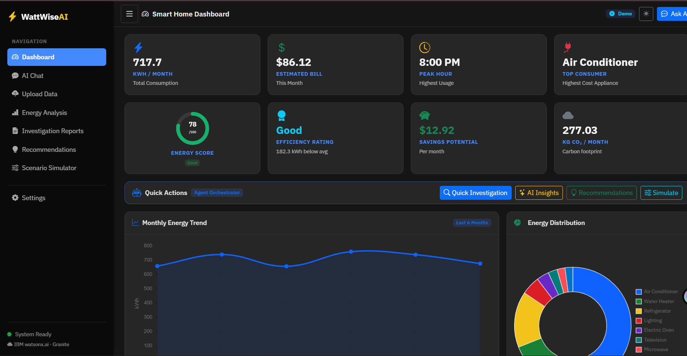
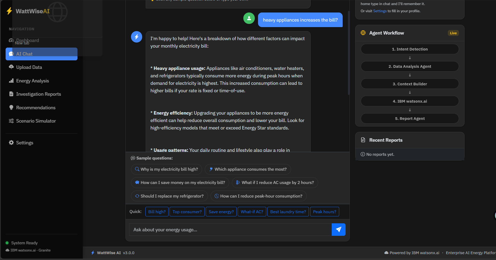
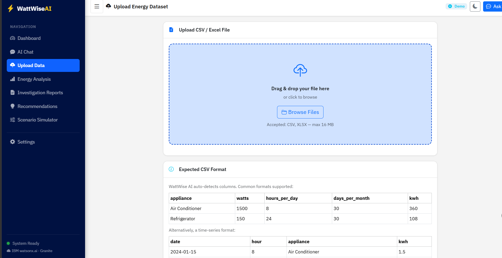
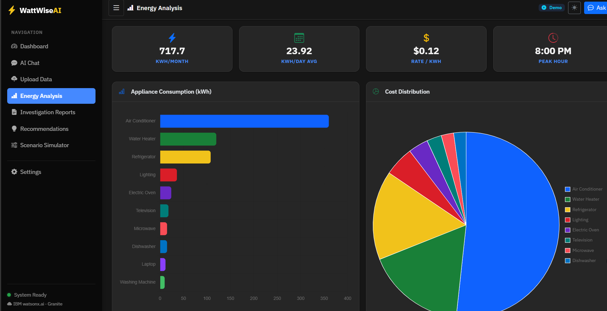
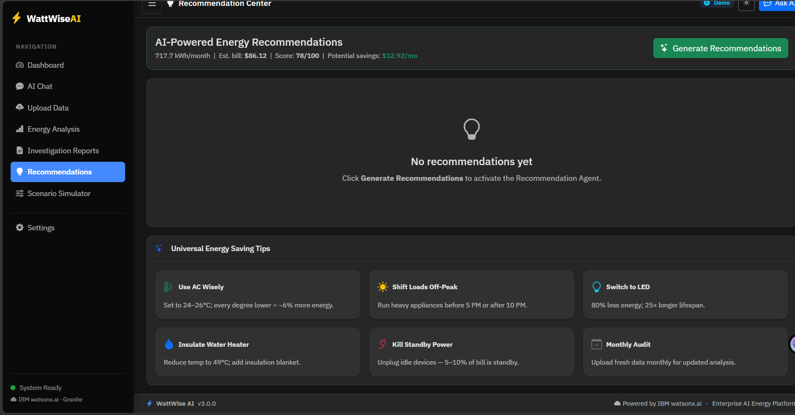

# WattWise AI

An AI-powered Smart Home Energy Investigation System using IBM watsonx.ai.




> **Enterprise AI-Powered Smart Home Energy Investigation System**
> Built with Python Flask · IBM watsonx.ai · Bootstrap 5 · IBM Granite

[](https://cloud.ibm.com)
[](https://www.ibm.com/watsonx)
[](https://python.org)
[](https://flask.palletsprojects.com)
[](https://getbootstrap.com)
[](LICENSE)

---

## Project Overview

**WattWise AI** is a production-ready, enterprise-grade web application that acts as an **AI Energy Investigation Officer**. It combines deterministic Python/Pandas energy analytics with IBM watsonx.ai (Granite LLM) reasoning to deliver an end-to-end energy management solution for households.

The system demonstrates modern **Agentic AI** architecture: a multi-agent orchestrator coordinates specialised agents to investigate, reason, and recommend — all grounded in verifiable evidence and explainable decisions.

---

## Problem Statement

Rising electricity bills are one of the top household financial concerns, yet most people have no visibility into:
- **Which appliances** are consuming the most energy
- **When** peak usage occurs and why it's expensive
- **What changes** will deliver meaningful savings
- **How confident** any analysis actually is

Utility dashboards show numbers — but not understanding, causes, or actionable guidance.

---

## Solution

WattWise AI investigates energy data the way a trained analyst would:

1. **Collects evidence** from uploaded CSV or demo dataset
2. **Ranks evidence** by severity and confidence
3. **Identifies root causes** using rule-based heuristics + AI reasoning
4. **Generates prioritised recommendations** with clear "why" explanations (XAI)
5. **Produces structured investigation reports** with case IDs, confidence scores, and savings estimates
6. **Simulates "what-if" scenarios** so users can predict the impact of changes before making them

---

## Features

| Feature | Description |
|---------|-------------|
| 🔍 **AI Investigation** | Evidence-based analysis of energy usage patterns |
| 💬 **Conversational AI Chat** | Natural language energy Q&A with session memory |
| 📊 **Interactive Dashboard** | KPIs, charts, energy score, CO₂ footprint |
| 📈 **Energy Analysis** | Full appliance breakdown with consumption charts |
| 📋 **Investigation Reports** | Professional PDF-exportable reports with case IDs |
| 💡 **Recommendations** | Prioritised, explainable AI-generated action plan |
| ⚡ **Scenario Simulator** | "What if I reduce AC by 2 hours?" impact calculator |
| 🎭 **Demo Mode** | Built-in realistic household dataset — no upload needed |
| ⚙️ **Settings** | Configurable rate, currency, location, goals, AI personality |
| 🌙 **Dark Mode** | IBM-inspired blue/green enterprise theme with dark mode |
| ♿ **Accessible** | WCAG-compliant with keyboard navigation and ARIA labels |

---

## Architecture

```
┌─────────────────────────────────────────────────────────────┐
│                      USER BROWSER                            │
│  Bootstrap 5 · Chart.js · IBM Plex Sans · Dark Mode          │
└─────────────────────┬───────────────────────────────────────┘
                      │  HTTP / AJAX
┌─────────────────────▼───────────────────────────────────────┐
│                 FLASK APPLICATION                            │
│  routes/main.py  ←→  Flask Session (server-side)            │
└────┬──────────────────┬────────────────────┬────────────────┘
     │                  │                    │
┌────▼────┐    ┌────────▼────────┐  ┌────────▼────────┐
│ Energy   │    │ Agent           │  │ Context         │
│ Analyzer │    │ Orchestrator    │  │ Builder         │
│ (Pandas) │    │                 │  │                 │
└────┬────┘    └──┬──┬──┬──┬─────┘  └────────┬────────┘
     │            │  │  │  │                  │
     │  ┌─────────┘  │  │  └─────────────────┐│
     │  │      ┌─────┘  └──────────┐         ││
     │  ▼      ▼                   ▼         ▼▼
  EnergyData  DataAnalysis  Investigation  Recommendation
  Analyzer    Agent         Agent          Agent
     │                                         │
     └──────────────┬──────────────────────────┘
                    │
          ┌─────────▼─────────┐
          │  IBM watsonx.ai    │
          │  (IBM Granite LLM) │
          │  Reasoning Layer   │
          └─────────┬─────────┘
                    │
          ┌─────────▼─────────┐
          │   Report Agent     │
          │   Final Report     │
          └───────────────────┘
```

**Design Principle:** Python calculates → Context Builder packages evidence → IBM watsonx.ai reasons.  
The AI never sees raw CSV data — only structured, pre-calculated summaries.

---

## Technology Stack

| Layer | Technology |
|-------|-----------|
| **Backend** | Python 3.9+, Flask 3.0, Vercel |
| **AI / LLM** | IBM watsonx.ai (IBM Granite), ibm-watsonx-ai SDK |
| **Data Processing** | Pandas, NumPy |
| **Frontend** | Bootstrap 5.3, Chart.js 4, IBM Plex Sans |
| **Sessions** | Flask-Session (server-side filesystem) |
| **File Processing** | Pandas CSV/Excel reader, openpyxl |
| **Security** | python-dotenv, werkzeug sanitisation, CSP headers |

---

## IBM Cloud Services Used

| Service | Usage |
|---------|-------|
| **IBM watsonx.ai** | Foundation model (Granite) for investigation, recommendations, chat, scenario reasoning |
| **IBM Granite** | `ibm/granite-8b-code-instruct` — the primary LLM |
| **IBM Cloud Platform** | Application hosting (Cloud Foundry or Code Engine) |

---

## Folder Structure

```
wattwise_ai/
├── app.py                          # Flask application factory
├── config.py                       # Environment config + AGENT_INSTRUCTIONS
├── requirements.txt                # Python dependencies
├── .env.example                    # Environment variable template
├── DEPLOYMENT.md                   # IBM Cloud deployment guide
│
├── routes/
│   ├── __init__.py
│   └── main.py                     # All page routes + REST API endpoints
│
├── services/
│   ├── __init__.py
│   ├── agent_orchestrator.py       # Central AI pipeline coordinator
│   ├── agents.py                   # DataAnalysis, Investigation, Recommendation, Report agents
│   ├── energy_analyzer.py          # Deterministic Pandas calculations + demo data
│   ├── context_builder.py          # Structured evidence context for AI prompts
│   ├── watsonx_service.py          # IBM watsonx.ai API wrapper
│   ├── scenario_simulator.py       # What-if query parser + scenario builder
│   ├── session_memory.py           # User profile + conversation history
│   └── investigation_service.py   # Report composition helpers
│
├── utils/
│   ├── __init__.py
│   └── helpers.py                  # Shared utility functions
│
├── templates/
│   ├── base.html                   # Sidebar layout + dark mode + accessibility
│   ├── dashboard.html              # KPI cards, charts, quick investigation
│   ├── chat.html                   # AI conversation with agent workflow visualiser
│   ├── upload.html                 # CSV/Excel drag-drop upload
│   ├── analysis.html               # Full appliance breakdown + charts
│   ├── reports.html                # Report list
│   ├── report_detail.html          # Professional investigation report
│   ├── report_pdf.html             # Print-optimised PDF export view
│   ├── recommendations.html        # Prioritised XAI recommendation cards
│   ├── simulator.html              # What-if scenario simulator
│   ├── settings.html               # User settings, goals, theme
│   └── errors/                     # 400, 404, 413, 500 error pages
│
├── static/
│   ├── css/style.css               # IBM-inspired theme (light + dark mode)
│   ├── js/
│   │   ├── app.js                  # Shared: sidebar, dark mode, Chart.js factory
│   │   ├── dashboard.js            # Dashboard charts + investigation modal
│   │   ├── chat.js                 # Chat UI + agent workflow animation
│   │   ├── analysis.js             # Analysis charts
│   │   ├── upload.js               # File upload + drag-drop
│   │   ├── recommendations.js      # Recommendations page
│   │   ├── simulator.js            # Scenario simulator
│   │   └── settings.js             # Settings + theme switcher
│   └── sample_energy_data.csv      # Demo CSV for testing
│
├── data/                           # Uploaded files (git-ignored)
├── reports/                        # Generated report files (git-ignored)
└── .flask_session/                 # Server-side sessions (git-ignored)
```

---

## API Endpoints

| Method | Endpoint | Description |
|--------|----------|-------------|
| `POST` | `/api/chat` | Send AI chat message (intent detection + orchestration) |
| `POST` | `/api/upload` | Upload and analyse a CSV or Excel file |
| `POST` | `/api/investigate` | Trigger full investigation pipeline |
| `POST` | `/api/recommendations` | Generate AI-powered recommendation plan |
| `POST` | `/api/simulate` | Run a what-if scenario simulation |
| `POST` | `/api/quick-insights` | Generate 3 dashboard AI insights |
| `POST` | `/api/settings` | Update electricity rate, currency, profile, goals |
| `POST` | `/api/reset` | Clear session and return to demo mode |
| `GET`  | `/api/analysis-data` | Return current analysis JSON |

All API endpoints return `{ "status": "ok", ... }` on success and `{ "status": "error", "message": "..." }` on failure. Stack traces are never exposed.

---

## Environment Variables

| Variable | Required | Default | Description |
|----------|----------|---------|-------------|
| `IBM_API_KEY` | Yes | — | IBM Cloud API key for watsonx.ai |
| `PROJECT_ID` | Yes | — | watsonx.ai project ID |
| `IBM_URL` | No | `https://us-south.ml.cloud.ibm.com` | watsonx.ai regional endpoint |
| `MODEL_ID` | No | `ibm/granite-4-h-small` | Foundation model ID |
| `FLASK_SECRET_KEY` | Yes | *(insecure default)* | Flask session signing key |
| `FLASK_DEBUG` | No | `False` | Enable debug mode |
| `FLASK_PORT` | No | `5000` | HTTP port |
| `ELECTRICITY_RATE` | No | `0.12` | Default rate ($/kWh) |
| `CURRENCY_SYMBOL` | No | `$` | Default currency symbol |
| `COUNTRY` | No | `United States` | Default country for energy context |
| `APP_NAME` | No | `WattWise AI` | Application display name |
| `APP_VERSION` | No | `2.0.0` | Version displayed in footer |

---

## Installation & Quick Start

### Prerequisites

- Python 3.9 or higher
- pip
- An IBM Cloud account with a watsonx.ai project (for AI features)

### 1. Clone and enter the project

```bash
git clone https://github.com/<your-username>/WattWise-AI.git
cd wattwise_ai
```

### 2. Create a virtual environment

```bash
python -m venv venv

# Windows
venv\Scripts\activate

# macOS / Linux
source venv/bin/activate
```

### 3. Install dependencies

```bash
pip install -r requirements.txt
```

### 4. Configure environment variables

```bash
cp .env.example .env
```

Edit `.env` with your credentials:

```dotenv
# IBM watsonx.ai — required for AI features
IBM_API_KEY=your_ibm_api_key_here
PROJECT_ID=your_watsonx_project_id_here
IBM_URL=https://au-syd.ml.cloud.ibm.com   # change to match your project's region
MODEL_ID=ibm/granite-3-1-8b-base          # check supported models for your region

# Flask
FLASK_SECRET_KEY=change-this-to-a-long-random-string
FLASK_DEBUG=False
FLASK_PORT=5000

# Application defaults
ELECTRICITY_RATE=0.12
CURRENCY_SYMBOL=$
COUNTRY=United States
```

### 5. Run locally

```bash
python app.py
```

Open your browser at **http://localhost:5000**

> **Demo Mode:** WattWise AI includes a full built-in demo dataset — no CSV upload required. Explore all features immediately after startup.

---

## Getting IBM watsonx.ai Credentials

1. Sign in to [IBM Cloud](https://cloud.ibm.com)
2. Search for **watsonx.ai** in the catalog and create a project
3. Navigate to **Manage → Access (IAM) → API Keys** → Create a new API key
4. Copy your **Project ID** from the watsonx.ai project settings page
5. Select the appropriate regional endpoint and set `IBM_URL` in `.env`:

| Region | URL |
|--------|-----|
| US South | `https://us-south.ml.cloud.ibm.com` |
| Sydney | `https://au-syd.ml.cloud.ibm.com` |
| EU Frankfurt | `https://eu-de.ml.cloud.ibm.com` |
| Tokyo | `https://jp-tok.ml.cloud.ibm.com` |
| London | `https://eu-gb.ml.cloud.ibm.com` |

> **Important — activate your WML service instance:**
> After creating a new project in a different region, go to **IBM Cloud → Resource List → Watson Machine Learning**,
> find the instance in your target region, and ensure its status is **Active** (not Inactive).
> A new Lite-tier project sometimes requires you to open the instance and click **Launch** once to activate it.

> **Note — models differ by region:**
> Not all foundation models are available in every region. For `au-syd`, confirmed working models include:
> `meta-llama/llama-3-1-8b`, `meta-llama/llama-3-3-70b-instruct`, `ibm/granite-3-1-8b-base`, `ibm/granite-8b-code-instruct`.

---

## Deployment to IBM Cloud

See **[DEPLOYMENT.md](DEPLOYMENT.md)** for full IBM Cloud deployment instructions.

## Live Demo

The application is deployed on Render.

Live URL:
https://your-render-link.onrender.com

### Quick deploy to IBM Cloud Foundry

```bash
# Install IBM Cloud CLI
curl -fsSL https://clis.cloud.ibm.com/install/linux | sh

# Login
ibmcloud login --sso

# Target an organisation and space
ibmcloud target --cf

# Push the application
ibmcloud cf push wattwise-ai \
  --buildpack python_buildpack \
  -m 512M \
  --no-start

# Set environment variables
ibmcloud cf set-env wattwise-ai IBM_API_KEY "your_key"
ibmcloud cf set-env wattwise-ai PROJECT_ID "your_project_id"
ibmcloud cf set-env wattwise-ai FLASK_SECRET_KEY "$(python -c 'import secrets; print(secrets.token_hex(32))')"

# Start the app
ibmcloud cf start wattwise-ai
```

---

## AGENT_INSTRUCTIONS — Customise Without Code

The AI agent's behaviour is fully configurable in `config.py` under `AGENT_INSTRUCTIONS`:

```python
AGENT_INSTRUCTIONS = {
    # Identity
    "agent_role":           "Chief Energy Investigation Officer",
    "agent_persona":        "...",

    # Style
    "tone":                 "professional yet friendly",   # or "concise", "detailed"
    "investigation_style":  "evidence-based",             # or "forensic", "narrative"

    # Recommendations
    "max_recommendations":  6,
    "recommendation_style": "actionable",
    "energy_saving_goal_pct": 20,

    # Locale
    "country":             "United States",
    "currency_symbol":     "$",

    # Safety
    "safety_rules": [
        "Never recommend actions that could pose an electrical safety hazard.",
        "Always advise consulting a licensed electrician for wiring changes.",
        ...
    ],
}
```

No application logic changes required — only this configuration block.

---

## Supported CSV Formats

WattWise AI auto-detects column names. Exact column names are not required.

**Appliance Summary Format:**
```csv
appliance,watts,hours_per_day,days_per_month
Air Conditioner,1500,8,30
Refrigerator,150,24,30
Water Heater,2000,2,30
```

**Time Series Format:**
```csv
date,hour,appliance,kwh
2024-01-15,8,Air Conditioner,1.5
2024-01-15,19,Water Heater,2.0
```

Download the [sample CSV](static/sample_energy_data.csv) to see the expected format.

---

## Security

- API keys are stored in `.env` and never exposed to the browser or client-side JS
- `.env` is listed in `.gitignore`
- All user inputs are sanitised with `werkzeug.utils.secure_filename` and whitelist regex
- File uploads are validated for extension, size (max 16 MB), and row count (max 100,000)
- Server-side sessions — session data never exposed in cookies
- Security headers added to every response: `X-Content-Type-Options`, `X-Frame-Options`, `Referrer-Policy`
- Stack traces never shown to users in production
- HTTP 400/404/413/500 errors handled with user-friendly pages

---

## Project Highlights

- Built using Python Flask
- Integrated IBM watsonx.ai Foundation Models
- Multi-Agent AI Architecture
- Explainable AI (XAI) Recommendations
- AI Energy Investigation Engine
- Scenario Simulation Engine
- Interactive Dashboard
- CSV & Excel Analysis
- IBM Cloud Ready
- Render Deployment Ready


## Future Enhancements

| Enhancement | Description |
|-------------|-------------|
| 🔔 **Alerts & Notifications** | Email or SMS alerts when consumption exceeds thresholds |
| 📅 **Scheduling** | Automated monthly report generation |
| 🌡️ **Weather Integration** | Correlate energy usage with weather data |
| 🏠 **Smart Home APIs** | Direct integration with smart meters (SMETS2), smart plugs |
| 📱 **Mobile App** | Progressive Web App (PWA) with offline support |
| 📊 **Advanced Analytics** | ARIMA forecasting, anomaly detection |
| 👥 **Multi-User** | Household accounts with role-based access |
| 🔗 **IBM OpenPages** | Compliance reporting integration |
| 🌐 **Localisation** | Multi-language support |
| 🔌 **REST API** | Public API for third-party integrations |

---

## Screenshots

# 📸 Application Screenshots

# 📸 Application Preview

| Dashboard | AI Chat |
|-----------|---------|
|  |  |

| Upload | Analysis |
|--------|----------|
|  |  |

| Recommendations 
|----------------
|  

---

## License

MIT License — free for personal and commercial use.

```
Copyright (c) 2026 WattWise AI

Permission is hereby granted, free of charge, to any person obtaining a copy
of this software and associated documentation files (the "Software"), to deal
in the Software without restriction, including without limitation the rights
to use, copy, modify, merge, publish, distribute, sublicense, and/or sell
copies of the Software, and to permit persons to whom the Software is
furnished to do so, subject to the following conditions:

The above copyright notice and this permission notice shall be included in all
copies or substantial portions of the Software.

THE SOFTWARE IS PROVIDED "AS IS", WITHOUT WARRANTY OF ANY KIND, EXPRESS OR
IMPLIED, INCLUDING BUT NOT LIMITED TO THE WARRANTIES OF MERCHANTABILITY,
FITNESS FOR A PARTICULAR PURPOSE AND NONINFRINGEMENT.
```

---

<div align="center">
  <strong>WattWise AI</strong> · Powered by IBM watsonx.ai · Enterprise AI Energy Platform<br/>
  <em>Investigate. Understand. Save.</em>
</div>
